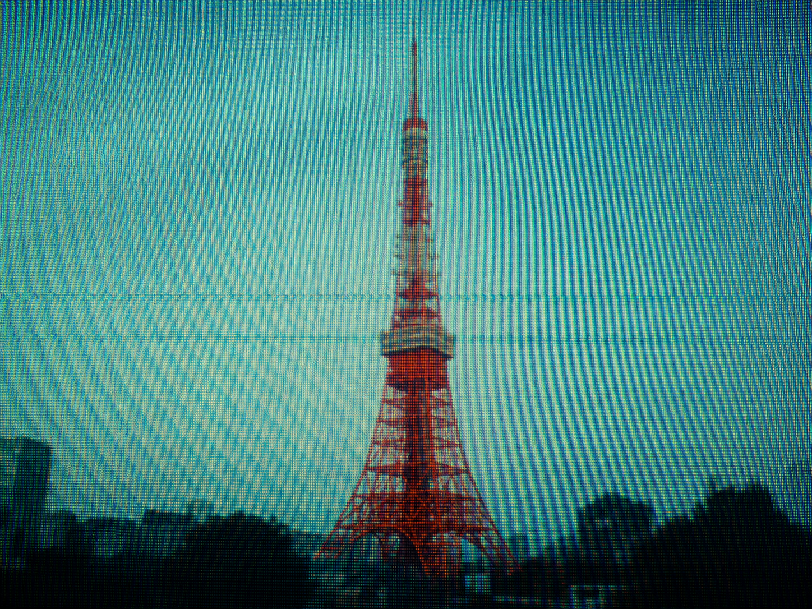
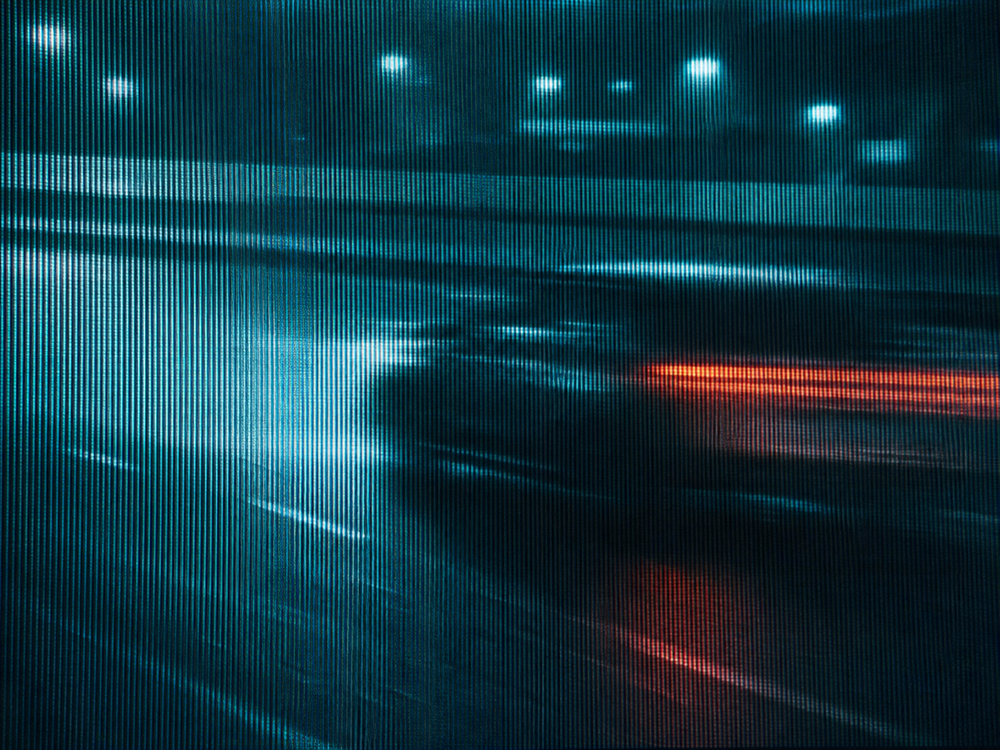
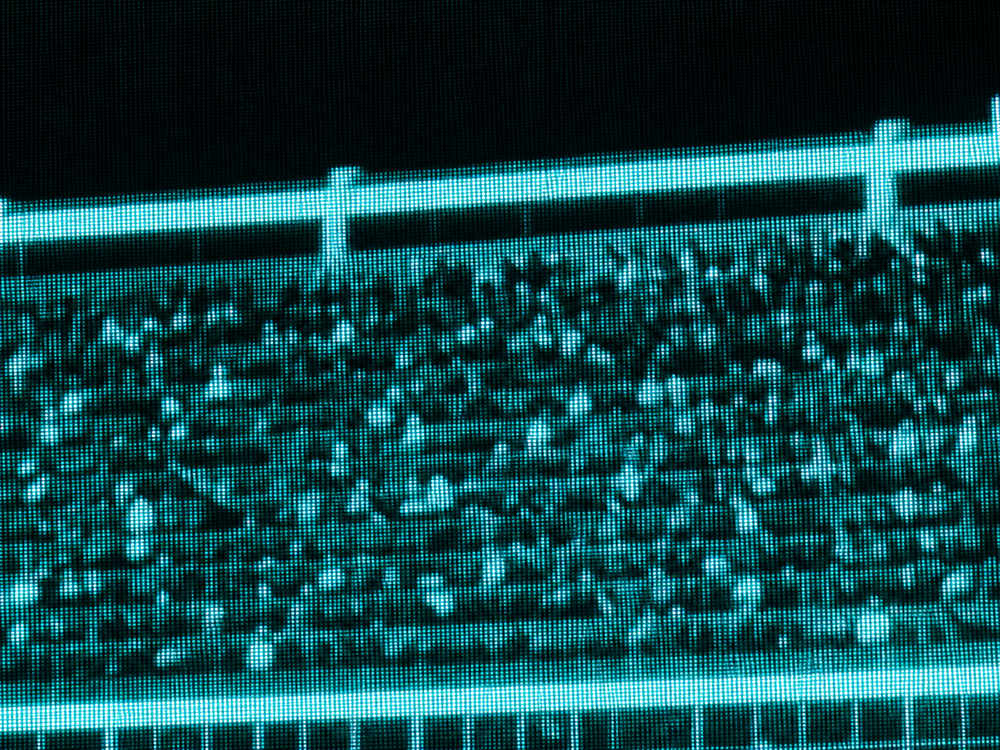

# Skills

我自用的 Agent Skills 集合。每个目录是一个独立技能，包含 `SKILL.md`（供模型执行）、参考资料和示例产出。

---

## phosphor-relay-style

**拍屏幕，不拍现场。**

一个图像风格技能：把任意题材编排成「一台相机对着一块正在播放转播画面的发光屏幕」所拍下的一帧，输出对应的提示词与图像。

核心是一套材质系统，不是滤镜：

- **二手光** —— 画面里唯一的光源是屏幕本身
- **网格即材质** —— 荧光点阵全画幅可见，高光里有、死黑里也有
- **冷场 + 一块暖** —— 青蓝统治色场，红/橙只作为单一连续色块出现
- **只有网格是锐的** —— 主体一律软焦、拖影、糊掉
- **非决定性瞬间** —— 拍动作周围：等待、背影、空看台、一只手

支持 **Treat**（给一张照片，只施加材质，保留原构图）和 **Originate**（从简报造一帧）两种模式。

| | | |
|:-:|:-:|:-:|
|  |  |  |
| Treat：地标重摄 | 拖抹信号 + 单块暖色 | 人群与结构，纹理即主体 |

→ [完整说明](phosphor-relay-style/README.md) ・ [试跑清单](phosphor-relay-style/EXAMPLES.md) ・ [失败修正表](phosphor-relay-style/references/repair-playbook.md)

```text
用 $phosphor-relay-style 做一张关于「雨后空荡球场」的图
```
